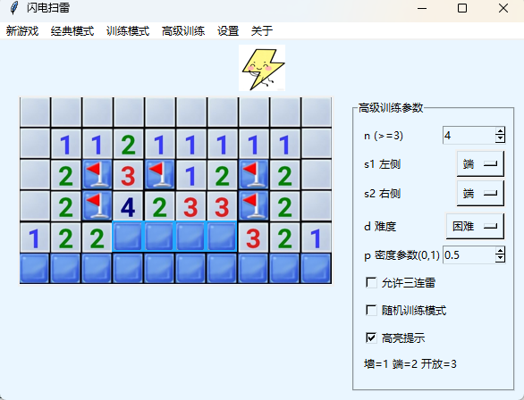
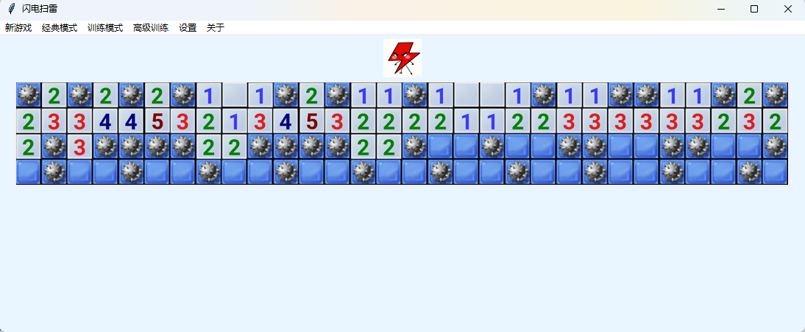

# 闪电扫雷 (lightning-minesweeper) 🎮

一个基于 Python 开发的扫雷训练器，具有丰富的游戏功能和各类训练模式。

- 🎯 **经典玩法** - 忠实还原 Windows 经典扫雷游戏
- 🎨 **美观界面** - 使用 tkinter 开发的图形化界面，且支持各种扫雷皮肤
- ⚡ **多难度选择** - 初级、中级、高级，且支持自定义雷数
- 🏆 **多种训练模式** - 漏雷训练、直线判雷、定式判雷

### 下载方式

见右侧releases

## 🎯 游戏截图

### 特别感谢：

initialencounter

---

**享受游戏！如有问题请提交 Issue.** 🎊
